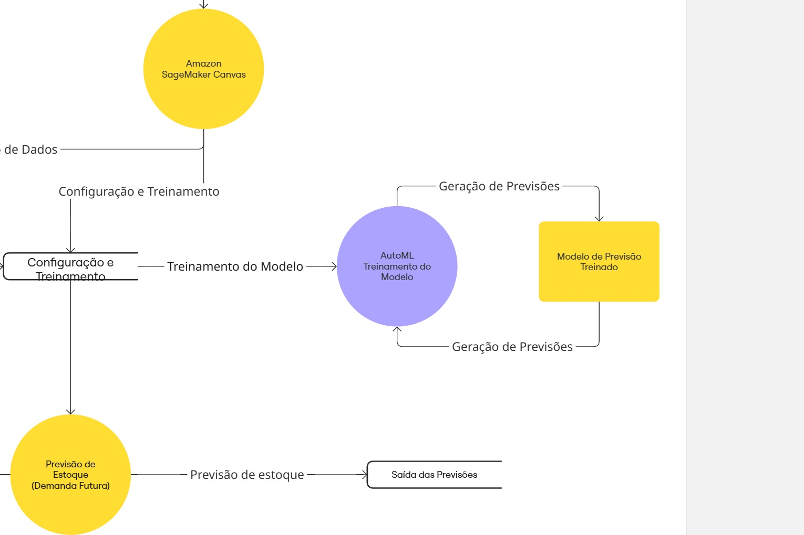

# 📊 Previsão de Estoque Inteligente na AWS com SageMaker Canvas

## 🏗️ Arquitetura do Projeto

A imagem acima representa o fluxo de dados e o processo de treinamento do modelo de Machine Learning utilizando o **Amazon SageMaker Canvas**, desde a importação do dataset até a geração das previsões de estoque.

---

## 📌 Descrição do Projeto
Este projeto tem como objetivo demonstrar a criação de um modelo de **Previsão de Estoque Inteligente** utilizando **Machine Learning no-code** com o **Amazon SageMaker Canvas**, conforme proposto no desafio da **DIO.me**.

O foco está na **análise preditiva de demanda**, permitindo que empresas antecipem necessidades de reposição de estoque, reduzindo perdas e otimizando custos operacionais.

---

## 🎯 Objetivos
- Aplicar conceitos de Machine Learning para previsão de estoque
- Simular o uso do Amazon SageMaker Canvas (ML no-code)
- Analisar métricas e variáveis que impactam a demanda
- Documentar todo o processo de forma clara e didática

---

## 📋 Dataset Utilizado
O dataset utilizado contém informações históricas de vendas e estoque, incluindo:

- Data
- Produto
- Quantidade vendida
- Estoque disponível
- Categoria
- Preço
- Promoções

📂 **Arquivo:** `datasets/estoque_vendas.csv`

---

## 🚀 Etapas do Projeto

### 1️⃣ Seleção e Upload do Dataset
O dataset foi selecionado a partir da pasta `datasets` do repositório e carregado no **Amazon SageMaker Canvas** por meio da opção **Import data**.

---

### 2️⃣ Construção e Treinamento do Modelo
No SageMaker Canvas, o processo foi realizado da seguinte forma:

- Definição da variável alvo: **Quantidade vendida**
- Seleção automática das variáveis de entrada
- Escolha do tipo de problema: **Previsão (Time Series / Regression)**
- Treinamento automático do modelo (**AutoML**)

O SageMaker Canvas realiza automaticamente:
- Limpeza de dados
- Seleção de algoritmos
- Ajuste de hiperparâmetros

---

### 3️⃣ Análise dos Resultados
Após o treinamento, foram analisadas as seguintes métricas:

- **MAE (Mean Absolute Error)**
- **RMSE (Root Mean Squared Error)**
- Importância das variáveis

Principais variáveis que influenciam a previsão:
- Histórico de vendas
- Sazonalidade
- Promoções
- Categoria do produto

---

### 4️⃣ Previsão de Estoque
Com o modelo treinado, foram geradas previsões futuras de demanda, permitindo:

- Antecipação de reposição de estoque
- Redução de ruptura
- Melhor planejamento logístico

As previsões podem ser exportadas em formato **CSV** para análise adicional.

---

## 📈 Insights Obtidos
- Produtos com maior sazonalidade exigem planejamento antecipado
- Promoções impactam significativamente o volume de vendas  
- Modelos preditivos auxiliam na tomada de decisão estratégica

---

## 🧠 Tecnologias Envolvidas
- [Amazon SageMaker Canvas](https://docs.aws.amazon.com/sagemaker/latest/dg/canvas.html)
- [Machine Learning (AutoML)](https://aws.amazon.com/machine-learning/)
- [Análise de Dados](https://aws.amazon.com/big-data/)
- [AWS Cloud](https://aws.amazon.com/)

---

## 🔗 Referências
- [Documentação oficial do Amazon SageMaker Canvas](https://docs.aws.amazon.com/sagemaker/latest/dg/canvas.html)  
- [Desafio DIO.me – Previsão de Estoque Inteligente](https://github.com/digitalinnovationone/lab-aws-sagemaker-canvas-estoque)

---

### 🤝 Connect with me
  

